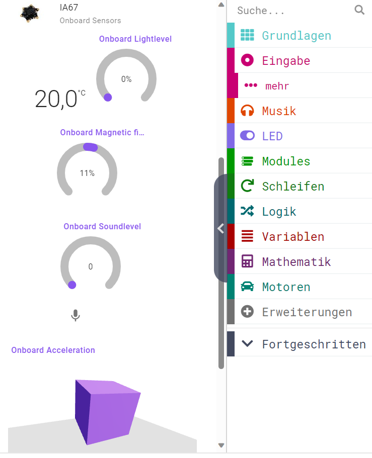

> Diese Seite bei [https://mkleinsb.github.io/pxt-calliope-jacdac/](https://mkleinsb.github.io/pxt-calliope-jacdac/) öffnen

# calliope-jacdac

Diese Erweiterung stellt die Onboardsensoren des Calliope mini V3 über die Jacdacschnittstelle zur Verfügung:
* Temperatur in Grad Cesius
* Helligkeit in %
* Magnetfeld -100% bis 100%
* Beschleunigung in x-,y-,z-Richtung in g
* Lautstärke in %

Einige Sachen laufen noch nicht! Hilfe/Fehlermeldungen/Tipps/Pull-requests erwünscht

## License

MIT License

Copyright (c) 2023 M. Klein

#### Metadaten (verwendet für Suche, Rendering)

* for PXT/calliopemini
